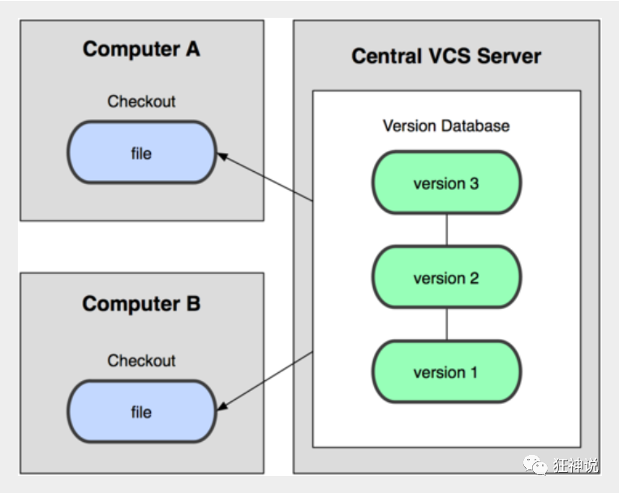

```
#查看配置
git config -l
#查看系统配置
git config --system --list
#查看当前用户配置
git config --global --list
#用户标识
git config --global user.name "qqq"  #名称
git config --global user.email 2@qq.com   #邮箱
# 在当前目录新建一个Git代码库
$ git init
# 克隆一个项目和它的整个代码历史(版本信息)
$ git clone [url]
#查看指定文件状态
git status [filename]
#查看所有文件状态
git status
#添加所有文件到暂存区
git add . 
#提交暂存区中的内容到本地仓库     -m:提交信息
git commit -m "消息内容"
#上传到公有仓库
git push
#生成公钥
进入 C:\Users\Administrator\.ssh 目录
生成公钥
$ ssh-keygen
# 列出所有本地分支
git branch
# 列出所有远程分支
git branch -r
# 新建一个分支，但依然停留在当前分支
git branch [branch-name]
# 新建一个分支，并切换到该分支
git checkout -b [branch]
# 合并指定分支到当前分支
$ git merge [branch]
# 删除分支
$ git branch -d [branch-name]
# 删除远程分支
$ git push origin --delete [branch-name]
$ git branch -dr [remote/branch]
```


## 版本控制

版本控制：方便查看文件的更改历史记录，备份以便恢复以前的版本的软件工程技术。

**常见的版本控制工具**

- **Git**
- **SVN**（Subversion）
- **CVS**（Concurrent Versions System）
- **VSS**（Micorosoft Visual SourceSafe）
- **TFS**（Team Foundation Server）
- Visual Studio Online

**版本控制分类**

**1、**本地版本控制

记录文件每次的更新，可以对每个版本做一个快照，适合个人用。

**2、**集中版本控制  SVN

所有的版本数据都保存在服务器上，协同开发者从服务器上同步更新或上传自己的修改



**3、**分布式版本控制 	Git

所有版本信息仓库全部同步到本地的每个用户（可保障数据不会丢失），github作为中转站，用户通过github进行最新数据的上传于下载


**git与SVN的区别**

SVN是集中式版本控制系统，版本库是集中放在中央服务器的，而工作的时候，用的都是自己的电脑，所以首先要从中央服务器得到最新的版本，然后工作，完成工作后，需要把自己做完的活推送到中央服务器。集中式版本控制系统是必须联网才能工作，对网络带宽要求较高。

Git是分布式版本控制系统，没有中央服务器，每个人的电脑就是一个完整的版本库，工作的时候不需要联网了，因为版本都在自己电脑上。协同的方法是这样的：比如说自己在电脑上改了文件A，其他人也在电脑上改了文件A，这时，你们两之间只需把各自的修改推送给对方，就可以互相看到对方的修改了。Git可以直接看到更新了哪些代码和文件！

Git是目前世界上最先进的分布式版本控制系统。

## Git环境配置

**下载与安装**

百度搜索git，进入官网直接下载

安装时，所有选项默认即可

**启动git**

安装成功后在开始菜单中会有Git项，菜单下有3个程序

Git Bash：Unix与Linux风格的命令行，使用最多，推荐最多

Git CMD：Windows风格的命令行

Git GUI：图形界面的Git，不建议初学者使用，尽量先熟悉常用命令

**Git配置**

```
#查看配置
git config -l
#查看系统配置
git config --system --list
#查看当前用户配置
git config --global --list
```

**Git相关的配置文件：**

1）、Git\etc\gitconfig  ：Git 安装目录下的 gitconfig       ——系统配置文件

2）、C:\Users\Administrator\ .gitconfig                    ——只适用于当前登录用户的配置 

**设置用户名与邮箱**

**（用户标识，必要）**

当你安装Git后首先要做的事情是设置你的用户名称和e-mail地址。这是非常重要的，因为每次Git提交都会使用该信息。它被永远的嵌入到了你的提交中：

````
git config --global user.name "kuangshen"  #名称
git config --global user.email 24736743@qq.com   #邮箱
````

## Git基本原理

**工作区域**

Git本地有三个工作区域：工作目录（Working Directory）、暂存区(Stage/Index)、资源库(Repository或Git Directory)。如果在加上远程的git仓库(Remote Directory)就可以分为四个工作区域。文件在这四个区域之间的转换关系如下：

.webp)

- Workspace：工作区，就是你平时存放项目代码的地方
- Index / Stage：暂存区，用于临时存放你的改动，事实上它只是一个文件，保存即将提交到文件列表信息
- Repository：仓库区（或本地仓库），就是安全存放数据的位置，这里面有你提交到所有版本的数据。其中HEAD指向最新放入仓库的版本
- Remote：远程仓库，托管代码的服务器，可以简单的认为是你项目组中的一台电脑用于远程数据交换

工作流程

git的工作流程一般是这样的：

１、在工作目录中添加、修改文件；

２、将需要进行版本管理的文件放入暂存区域；

３、将暂存区域的文件提交到git仓库。

因此，git管理的文件有三种状态：已修改（modified）,已暂存（staged）,已提交(committed)


## Git项目搭建

创建本地仓库的方法有两种：一种是创建全新的仓库，另一种是克隆远程仓库。

**本地仓库搭建**

1、创建全新的仓库，需要用GIT管理的项目的根目录执行：

```
# 在当前目录新建一个Git代码库
$ git init
```

**克隆远程仓库**

1、另一种方式是克隆远程目录，由于是将远程服务器上的仓库完全镜像一份至本地！

```
# 克隆一个项目和它的整个代码历史(版本信息)
$ git clone [url]
```

## Git文件操作

**查看文件状态**

通过如下命令可以查看到文件的状态：

```
#查看指定文件状态
git status [filename]
#查看所有文件状态
git status
#添加所有文件到暂存区
git add . 
#提交暂存区中的内容到本地仓库     -m:提交信息
git commit -m "消息内容"
```

**忽略文件**

有些时候我们不想把某些文件纳入版本控制中，比如数据库文件，临时文件，设计文件等

在主目录下建立".gitignore"文件，此文件有如下规则：

1. 忽略文件中的空行或以井号（#）开始的行将会被忽略。
2. 可以使用Linux通配符。例如：星号（*）代表任意多个字符，问号（？）代表一个字符，方括号（[abc]）代表可选字符范围，大括号（{string1,string2,...}）代表可选的字符串等。
3. 如果名称的最前面有一个感叹号（!），表示例外规则，将不被忽略。
4. 如果名称的最前面是一个路径分隔符（/），表示要忽略的文件在此目录下，而子目录中的文件不忽略。
5. 如果名称的最后面是一个路径分隔符（/），表示要忽略的是此目录下该名称的子目录，而非文件（默认文件或目录都忽略）。

```
*.txt        #忽略所有 .txt结尾的文件,这样的话上传就不会被选中！
!lib.txt     #但lib.txt除外
/temp        #仅忽略项目根目录下的TODO文件,不包括其它目录temp
build/       #忽略build/目录下的所有文件
doc/*.txt    #会忽略 doc/notes.txt 但不包括 doc/server/arch.txt
```

## 使用码云

1、设置本机绑定SSH公钥，实现免密码登录！（免密码登录，这一步挺重要的，码云是远程仓库，我们是平时工作在本地仓库！)

```
# 进入 C:\Users\Administrator\.ssh 目录
# 生成公钥
$ ssh-keygen
```

2、将公钥信息public key 添加到码云账户中即可！

## GIT分支

分支在GIT中相对较难，分支就是科幻电影里面的平行宇宙，如果两个平行宇宙互不干扰，那对现在的你也没啥影响。不过，在某个时间点，两个平行宇宙合并了，我们就需要处理一些问题了！


****

**git分支中常用指令：**

````
# 列出所有本地分支
git branch
# 列出所有远程分支
git branch -r
# 新建一个分支，但依然停留在当前分支
git branch [branch-name]
# 新建一个分支，并切换到该分支
git checkout -b [branch]
# 合并指定分支到当前分支
$ git merge [branch]
# 删除分支
$ git branch -d [branch-name]
# 删除远程分支
$ git push origin --delete [branch-name]
$ git branch -dr [remote/branch]
````

如果同一个文件在合并分支时都被修改了则会引起冲突：解决的办法是我们可以修改冲突文件后重新提交！选择要保留他的代码还是你的代码！

master主分支应该非常稳定，用来发布新版本，一般情况下不允许在上面工作，工作一般情况下在新建的dev分支上工作，工作完后，比如上要发布，或者说dev分支代码稳定后可以合并到主分支master上来。

